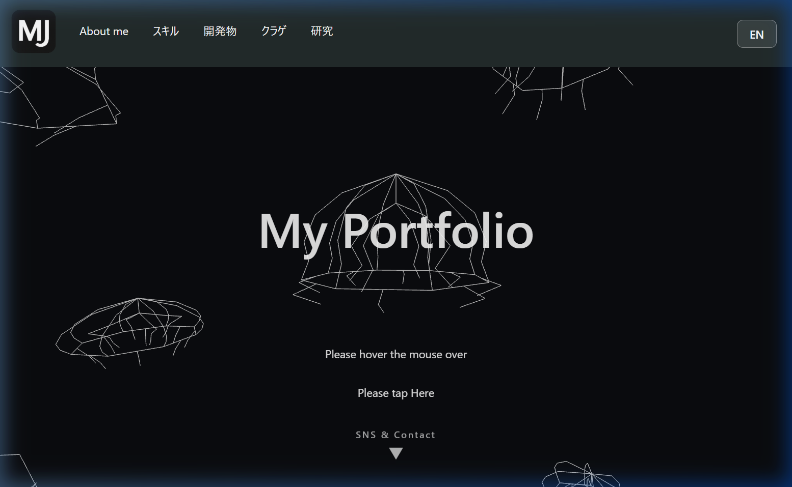

# jellYTM Portfolio 🪼

個人的なポートフォリオサイトのソースコードです。
React + TypeScript + Vite で構築されており、背景にはThree.jsを用いたオリジナルデータのクラゲアニメーションが動いています。

## 🌐 ポートフォリオはこちらのリンクから
**[https://mj-kun-portfolio.vercel.app/](https://mj-kun-portfolio.vercel.app/)**

## ✨ 特徴
- **Three.js アニメーション**: ビデオフレームの計測データに基づき構築された、リアリティのあるミズクラゲの拍動アニメーション。
- **完全な多言語対応 (🇬🇧/🇯🇵)**: すべてのページ（About me, スキル, 開発物, クラゲ図鑑, 研究, フッター等）が英語と日本語に完全対応。
- **データ駆動アーキテクチャ**: すべてのテキスト、画像パス、SNSリンクなどは `src/data/*.json` ファイルで管理されており、ソースコードを触らずにコンテンツを修正・追加できます。
- **レスポンシブデザイン**: スマートフォン、タブレット、PCに対応し、デバイスに応じて最適なレイアウト（固定ヘッダー・フローティングボタン・アコーディオンなど）を提供します。

## 🛠️ 技術スタック
- **Core**: React, TypeScript, Vite
- **Routing**: react-router-dom
- **Animation/3D**: Three.js
- **Styling**: Vanilla CSS (CSS Modules / Media Queries)
- **Deployment**: Vercel

## 📝 ライセンス
このプロジェクトのソースコードはオープンソースベースですが、テキストコンテンツ、画像、動画、およびクラゲのトラッキングデータ・設計図等の資産の無断転載・再利用はお控えください。
